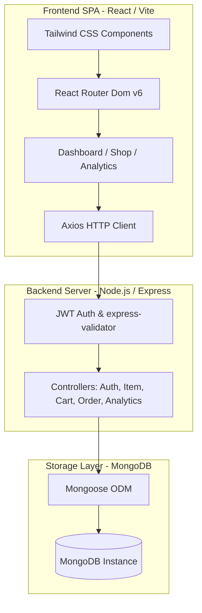
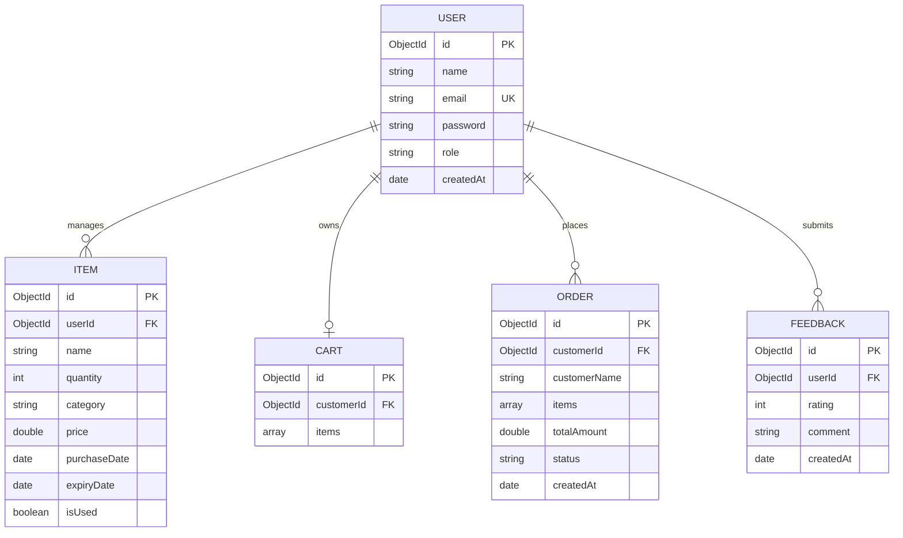

# 🛒 Smart Grocery Management System

[](https://nodejs.org/)
[](https://expressjs.com/)
[](https://react.dev/)
[](https://www.mongodb.com/)
[](https://tailwindcss.com/)
[](https://jwt.io/)
[](https://vitejs.dev/)

A full-stack, enterprise-ready web application engineered to manage grocery inventories, proactively track product expiration dates, and automatically recommend replenishment schedules. The system features a decoupled client-server architecture, role-based access controls, interactive sales and product analytics, and a mathematical replenishment prediction engine.

---

## 🌟 Executive Summary & Key Value Prop

In modern households and commercial establishments, food waste and inventory stock-outs represent significant inefficiencies. The **Smart Grocery Management System** solves this by providing:
1. **Zero-Waste Tracking**: Real-time monitoring of food longevity with color-coded safety visualizers.
2. **Predictive Replenishment**: An algorithmic engine that analyzes historical purchasing intervals to predict stock exhaustion dates.
3. **Unified Commerce Model**: Customer-facing shopping cart/checkout flows alongside a robust admin dashboard for stock management and sales analytics.

---

## 🏗️ System Architecture & Data Flow

The application is structured as a decoupled Single Page Application (SPA) communicating over a secure RESTful API with a MongoDB database.



---

## 🧠 Core Engineering Features & Deep Dives

### 1. Smart Restocking Engine (Algorithm Deep Dive)
The restocking engine mathematically models user consumption habits. Rather than using arbitrary alert schedules, the system computes the moving average of intervals between purchases for each specific item:

$$\text{Interval}_i = \text{purchaseDate}_i - \text{purchaseDate}_{i-1}$$
$$\text{Average Interval} = \frac{1}{N-1} \sum_{i=2}^{N} \text{Interval}_i$$

The engine then checks the elapsed time since the most recent purchase ($\Delta t_{\text{elapsed}}$):
* If $\Delta t_{\text{elapsed}} \ge \text{Average Interval}$, a high-priority recommendation is generated suggesting immediate restocking.
* If $\Delta t_{\text{elapsed}} < \text{Average Interval}$, the engine forecasts the remaining days ($T_{\text{remaining}} = \text{Average Interval} - \Delta t_{\text{elapsed}}$) until the next suggested restock.

*Implementation Reference:* [`server/controllers/itemController.js` > `getSuggestions`](file:///c:/Users/Asus/OneDrive/Desktop/project%20for%20inturnship-1/smart-grocery-system/server/controllers/itemController.js#L153-L199)

### 2. Role-Based Access Control (RBAC) & Router Guards
The system enforces strict boundary separation between **Customer** and **Admin** operations. 
* **Backend Guarding:** Routes are protected using nested Express middleware (`auth` and `admin` guards) that verify the integrity of the Bearer JWT token and check the `role` claim in the MongoDB user document.
* **Frontend Guarding:** React client uses context-driven state to render dashboard widgets conditionally and prevent unauthorized manual URL routing.

### 3. High-Fidelity Admin Analytics
Leveraging **Recharts**, the admin panel exposes crucial metrics to track store health, rendering dynamic graphs for:
- **Sales Trends by Date**: Aggregates order values chronologically using MongoDB pipeline operators.
- **Top Performing Products**: Tallies quantity-wise product sales to pinpoint inventory demand.
- **Store Overview Card Deck**: Visualizes global states including gross revenue, order volume, and customer enrollment.

---

## 💾 Schema Design

The MongoDB database contains five interlinked models optimized for lookup speed and data normalization:



---

## 🛠️ Tech Stack & Technical Decisions

| Layer | Component | Choice | Rationale |
| :--- | :--- | :--- | :--- |
| **Frontend** | Framework | React 18 (Vite) | Offers fast Hot Module Replacement (HMR) and optimized build bundles. |
| | Styling | Tailwind CSS v3 | Utility-first framework ensuring precise design consistency without CSS bloat. |
| | State & Routing | React Context API & React Router v6 | Lightweight global auth state with declarative route boundaries. |
| | Charts | Recharts | Declarative SVG-based charting library tailored for responsive React apps. |
| | Animation | Framer Motion | Provides micro-interactions and transitions (e.g. cart transitions). |
| **Backend** | Environment | Node.js with Express | Event-driven, non-blocking I/O model ideal for scalable JSON APIs. |
| | Input Validation | Express Validator | Ensures fail-fast requests and validates request body schemas before controller execution. |
| **Database** | Database Engine | MongoDB & Mongoose | Document database mapping cleanly to Javascript objects; Mongoose enforces strict validation schemas. |
| **Security** | Auth / Encrypt | JSON Web Token (JWT) & BcryptJS | Stateless session architecture paired with robust password hashing algorithms. |

---

## 📂 Project Structure & Clean Code Organization

The workspace is split into decoupled frontend (`client`) and backend (`server`) modules:

```
smart-grocery-system/
├── client/                     # Frontend SPA (React + Vite)
│   ├── src/
│   │   ├── components/         # Reusable UI elements (Navbar, Cards, Charts, Forms)
│   │   ├── pages/              # Routed pages (Dashboard, Admin, Shop, Login)
│   │   ├── services/           # Axios interceptors & API communication layer
│   │   ├── context/            # AuthContext & global state providers
│   │   ├── App.jsx             # Route definitions & layout wrappers
│   │   └── main.jsx            # Application entrypoint
│   ├── package.json            # Frontend dependency manifest
│   └── tailwind.config.js      # Custom design system configurations
│
└── server/                     # Backend API Service (Node + Express)
    ├── config/                 # DB connection and config initializations
    ├── controllers/            # Controller logic (separates execution from routing)
    ├── middleware/             # Route guards, error handlers, and validator checks
    ├── models/                 # Mongoose schemas (User, Item, Order, Cart, Feedback)
    ├── routes/                 # Express route definitions
    ├── server.js               # Express application bootstrap
    └── package.json            # Backend dependency manifest
```

---

## 🔌 API Reference & Endpoints

### Authentication Endpoints
| HTTP Method | Route | Access | Request Payload | Description |
| :--- | :--- | :--- | :--- | :--- |
| `POST` | `/api/auth/signup` | Public | `{ name, email, password, role }` | Registers a new user account (defaults to `customer`). |
| `POST` | `/api/auth/login` | Public | `{ email, password }` | Authenticates user; returns signed bearer JWT. |

### Grocery Item Endpoints
| HTTP Method | Route | Access | Request Parameters / Payload | Description |
| :--- | :--- | :--- | :--- | :--- |
| `GET` | `/api/items` | Customer / Admin | `?search=str&category=str&status=str` | Retrieves list of items matching filters. |
| `POST` | `/api/items` | Admin | `{ name, quantity, category, price, purchaseDate, expiryDate }` | Creates a new grocery item. |
| `GET` | `/api/items/:id` | Customer / Admin | `id` in URL | Fetches detail of a specific item. |
| `PUT` | `/api/items/:id` | Admin | `{ name, quantity, category, price, purchaseDate, expiryDate }` | Updates item attributes. |
| `DELETE` | `/api/items/:id` | Admin | `id` in URL | Permanently removes an item from storage. |
| `PATCH` | `/api/items/:id/mark-used` | Customer | `id` in URL | Toggles item usage status (`isUsed: true`). |
| `GET` | `/api/items/suggestions` | Customer | None | Calculates and returns restock alerts. |

### Cart Endpoints
| HTTP Method | Route | Access | Request Payload | Description |
| :--- | :--- | :--- | :--- | :--- |
| `GET` | `/api/cart` | Customer | None | Retrieves user's active shopping cart. |
| `POST` | `/api/cart/add` | Customer | `{ itemId, name, quantity, price }` | Adds an item or updates quantity in cart. |
| `PATCH` | `/api/cart/:itemId`| Customer | `{ quantity }` | Updates item count in the cart. |
| `DELETE` | `/api/cart/:itemId`| Customer | `itemId` in URL | Removes item from the cart. |
| `DELETE` | `/api/cart` | Customer | None | Clears all items from cart. |

### Order Endpoints
| HTTP Method | Route | Access | Request Payload | Description |
| :--- | :--- | :--- | :--- | :--- |
| `POST` | `/api/orders` | Customer | None | Finalizes checkout, converting cart items into an Order. |
| `GET` | `/api/orders/my` | Customer | None | Retrieves logged-in user's order history. |
| `GET` | `/api/orders/all` | Admin | None | Returns all orders in system (admin oversight). |
| `PATCH` | `/api/orders/:id/status`| Admin | `{ status: "pending | completed | cancelled" }` | Updates checkout order workflow status. |

### Analytics Endpoints
| HTTP Method | Route | Access | Query Parameters | Description |
| :--- | :--- | :--- | :--- | :--- |
| `GET` | `/api/analytics/sales-by-date` | Admin | None | Timeline sales trend database aggregation. |
| `GET` | `/api/analytics/top-products` | Admin | None | Returns top volume product metrics. |
| `GET` | `/api/analytics/dashboard-stats` | Admin | None | High level system counters (revenue, user counts). |

---

## ⚡ Setup & Installation

### Prerequisites
- **Node.js** (v16.0.0 or higher)
- **MongoDB** (local daemon running on port 27017 or a MongoDB Atlas Cloud cluster URI)

### Phase 1: Clone and Environment Setup
```bash
# Clone the repository
git clone https://github.com/<your-username>/smart-grocery-management-system.git
cd smart-grocery-management-system
```

### Phase 2: Server Configuration
1. Navigate to the server folder and install dependencies:
   ```bash
   cd server
   npm install
   ```
2. Create a `.env` file in the root of the `/server` directory:
   ```env
   PORT=5000
   MONGO_URI=mongodb://localhost:27017/smart-grocery
   JWT_SECRET=use_a_robust_cryptographic_secret_key_here
   CLIENT_URL=http://localhost:3000
   NODE_ENV=development
   ```
3. Launch server in development mode:
   ```bash
   npm run dev
   ```
   *The server will boot up and bind to `http://localhost:5000`.*

### Phase 3: Frontend Configuration
1. Navigate to client folder:
   ```bash
   cd ../client
   npm install
   ```
2. Launch client hot dev server:
   ```bash
   npm run dev
   ```
   *The frontend application will boot on `http://localhost:3000` and proxy calls automatically to the backend.*

---

## 🔐 Security Best Practices Integrated
- **Cryptographic Storage**: Client passwords never hit database in cleartext; they are pre-hashed using `bcryptjs` with salt complexity of 10.
- **Fail-Safe Route Guards**: System requests automatically pass through standard Express error-handling middleware to prevent raw stack-trace leaks to users.
- **Validated Ingress**: Request validation is strictly enforced at route level via `express-validator` to protect against SQL/NoSQL Injection vectors and malformed payloads.

---

## 📄 License
This project is licensed under the MIT License - see the [LICENSE](LICENSE) file for details.
